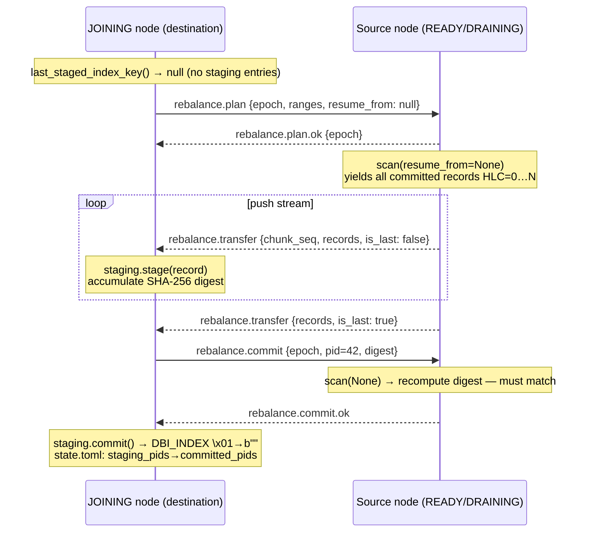
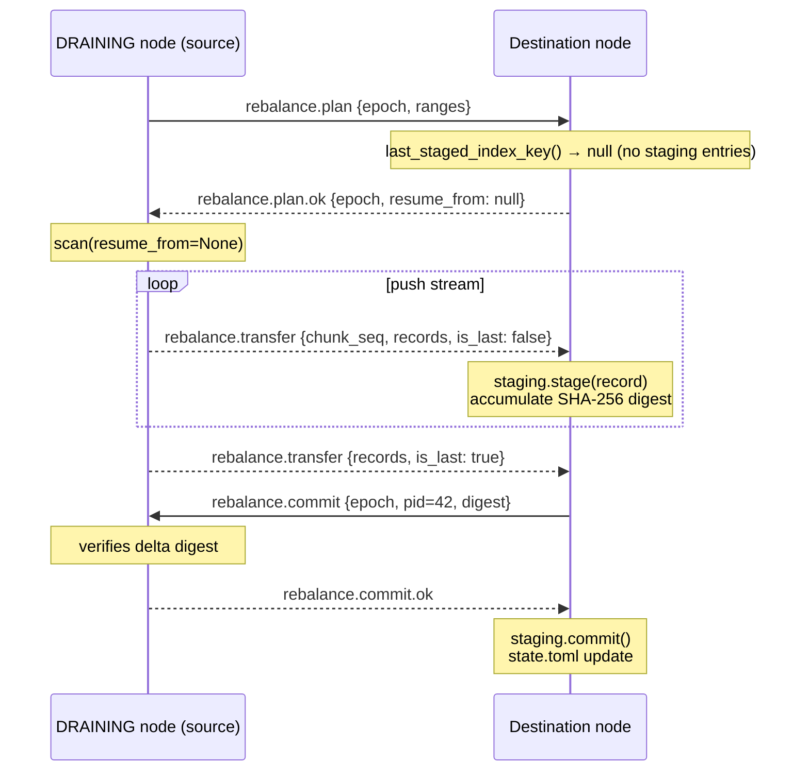
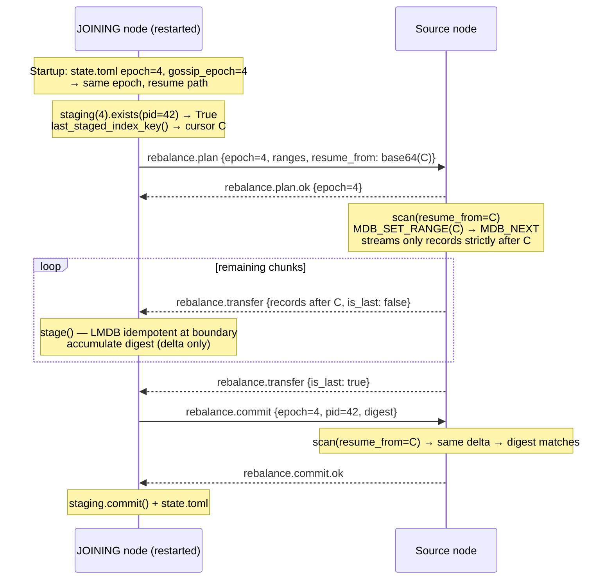
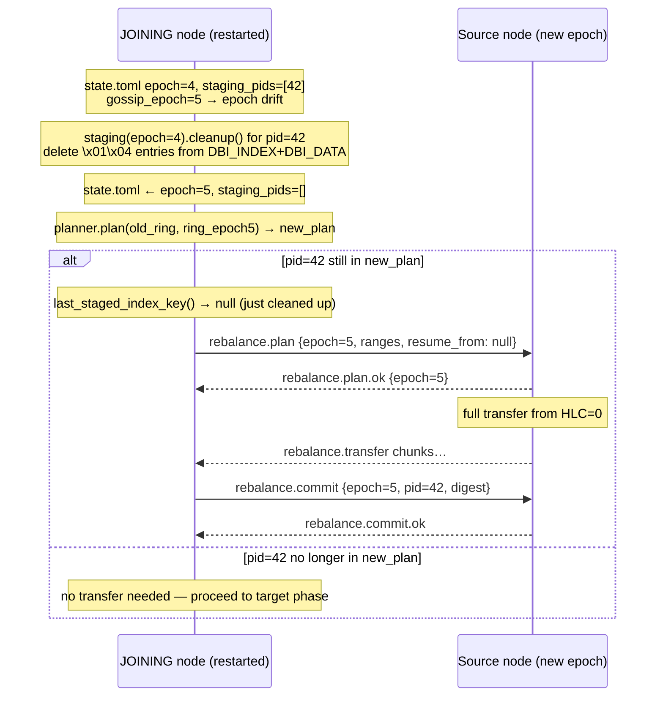

# Proposal: Partition Rebalance

**Author**: Souleymane BA <soulsmister@gmail.com>
**Status:** Accepted
**Date:** 2026-05-11
**Sequence:** 005
**Revision:** 2
**Continues:** proposal-gossip-seeded-join-05102026-004 (`JOINING → READY` deferred)

---

> **Continuation of proposal 004.** Proposal 004 (Gossip Engine & Seeded Node
> Join) defined the `IDLE → JOINING` transition and explicitly deferred the
> `JOINING → READY` transition to a dedicated rebalance proposal. This proposal
> fulfils that commitment: it specifies and implements the full partition
> rebalance protocol that drives a node from `JOINING → READY` (receiving
> partitions) and from `DRAINING → IDLE` (sending partitions).

---

## Summary

This proposal is the direct continuation of proposal 004, which left a node
in the `JOINING` phase after gossip bootstrap with no mechanism to advance to
`READY`. The missing piece is partition data transfer: a `JOINING` node must
receive all partitions it owns in the new ring before it can serve KV traffic;
a `DRAINING` node must send all its partitions before it can leave.

This proposal defines how Tourillon performs that redistribution: a
deterministic planner, a stateful applicator, a streaming wire protocol with
crash-safe staging, and an operator-visible `tourctl rebalance status` command.
Completion of all transfers triggers the `JOINING → READY` or `DRAINING → IDLE`
phase transition that proposal 004 explicitly deferred.

The storage design in this proposal uses LMDB (two named DBIs: `DBI_INDEX` and
`DBI_DATA`) as the **reference implementation**, chosen for its ACID guarantees,
transactional multi-DBI writes, and cursor-based iteration. However, the domain
layer depends exclusively on the `Storage` / `PartitionStore` / `PartitionStaging`
**Protocol interfaces** defined in `core/ports/storage.py`. Any backend that
satisfies those interfaces — an in-memory adapter, a different embedded store,
or a future pluggable engine — is a valid candidate. LMDB-specific concepts
(DBI handles, `MDB_SET_RANGE`, transaction semantics) are confined to
`tourillon/infra/store/` and never leak into `core/`.

---

## Motivation

Proposal 004 established that a node completing gossip bootstrap enters the
`JOINING` phase with its vnodes in the ring but without any partition data.
Without a rebalance mechanism, that node would remain stuck in `JOINING`
indefinitely — owning ring partitions it has no data for, causing read misses,
and never opening its KV socket. A leaving node faces the symmetric problem: it
holds data that should belong to its successors but has no way to transfer it.
This proposal closes that gap while guaranteeing no data loss on crash, no
duplicate work on restart, and clean cancellation when topology changes again
mid-transfer.

---

## CLI contract

### `tourctl rebalance status <addr> [--after-pid <n>] [--limit <n>] [--blocked] [--json]`

Queries the rebalance status of the node at `<addr>` (the target's peer
address, e.g. `10.0.0.2:7701`). `tourctl` opens a direct mTLS connection
straight to `<addr>` and sends the request — no contact node, no forwarding.
The address is mandatory — there is no
implicit fallback to the active context's peer endpoint. Paginated by default
(`--limit 500`):
pass `--after-pid` and `--limit` for clusters with large partition counts.
With `pshift=17` (131 072 partitions) pagination is **required** — do not
attempt to render all partitions in a single call.

**Active vs inactive partitions**: a partition is *active* when it has a
`TransferHandle` **and** either (a) is in a non-terminal state (PENDING,
RUNNING), or (b) is in a terminal state other than an empty commit
(FAILED, CANCELLED, or COMMITTED with `bytes_done > 0`). A partition is
*inactive* when it falls into one of two categories:

1. **No TransferHandle** — it exists in the ring topology but was
   never enrolled in a transfer plan (possible only when `total_partitions`
   is supplied and exceeds the number of planned handles).
2. **Empty committed** — it has a COMMITTED `TransferHandle` with
   `bytes_done == 0`, meaning the partition was planned and the transfer
   completed successfully but contained no records (common in small
   clusters where most partitions are empty).

Inactive partitions do not appear in the table and do not count toward
`active_partitions` in the Summary line.

**Node in JOINING (destination — receiving partitions):**

```
$ tourctl rebalance status 10.0.0.3:7701

Rebalance status — node-3  (epoch 4, JOINING → READY)
Role: receiving
Summary: 50 active partitions (48 committed, 1 running, 1 failed)

 PID   FROM     TO       STATE       CHUNKS    BYTES      AGE    LAST_ERROR
─────────────────────────────────────────────────────────────────────────────
  42   node-2   node-3   COMMITTED    128       4.2 MiB   12s    —
  43   node-2   node-3   RUNNING      61/128    2.0 MiB    4s    —
  44   node-2   node-3   FAILED       45/128    1.5 MiB    8s    source unreachable
  45   node-1   node-3   PENDING        —         —        —     —
  67   node-2   node-3   CANCELLED      —         —        8s    —
```

**Node in DRAINING (source — sending partitions):**

```
$ tourctl rebalance status 10.0.0.2:7701

Rebalance status — node-2  (epoch 4, DRAINING → IDLE)
Role: sending
Summary: 50 active partitions (48 committed, 2 running, 0 failed)

 PID   FROM     TO       STATE       CHUNKS    BYTES      AGE    LAST_ERROR
─────────────────────────────────────────────────────────────────────────────
  42   node-2   node-3   COMMITTED    128       4.2 MiB   12s    —
  43   node-2   node-3   RUNNING      128/128   4.2 MiB    4s    —
  44   node-2   node-4   RUNNING       45/128   1.5 MiB    4s    —
  45   node-2   node-4   PENDING         —         —       —     —
  67   node-2   node-3   CANCELLED       —         —       8s    —
```

**Node BLOCKED (one or more FAILED transfers):**

```
$ tourctl rebalance status 10.0.0.3:7701 --blocked

Rebalance status — node-3  (epoch 4, JOINING → READY)
State: BLOCKED

Blocking transfers:
 PID   FROM     TO       STATE    LAST_ERROR
─────────────────────────────────────────────────────────────────────────────
  44   node-2   node-3   FAILED   source node-2 is FAILED
  51   node-5   node-3   FAILED   source unreachable after 10 retries

Operator hint:
  - Check node-2 and node-5 states (FAILED/PAUSED?).
  - Either:
      recover them (FAILED → JOINING / READY), or
      change topology to trigger a new epoch and plan.
```

`--blocked` filters the table to FAILED transfers only and shows the operator
hint block. Exit code 2 when the node is BLOCKED (in addition to the normal 0
/ 1 convention).

**No active rebalance:**

```
$ tourctl rebalance status 10.0.0.1:7701
No active rebalance on node-1.
```

Exit codes: 0 on success, 1 on any error, 2 when `--blocked` and the node is
BLOCKED.

**Streaming consideration**: with `pshift=17` and a 3-node cluster a node may
own up to ~43 000 partitions. The default `--limit 500` keeps each response
well below `MAX_PAYLOAD_DEFAULT`. The CLI renders one page at a time; pipe to
`--json` and process offline for bulk analysis.

---

## Design

### Data model

#### `HLCTimestamp` and `HLCClock` (`core/structure/clock.py`)

Immutable hybrid logical clock timestamp `(wall_ms, counter, node_id)` with
`tick()` and `update()` methods. Used as the version key (`metadata`) in every
storage record. `HLCClock` is the mutable stateful wrapper that advances the
timestamp monotonically for a single node.

#### LMDB storage layout

LMDB supports multiple **named databases** within a single environment — each
database is accessed via a `DBI` (database instance) handle. Tourillon opens
**two DBIs** per environment:

| DBI name | Handle constant | Purpose |
|----------|-----------------|---------|
| `"index"` | `DBI_INDEX` | Chronological ordering within a partition (HLC cursor) |
| `"data"`  | `DBI_DATA`  | Per-key multi-version storage (latest-HLC lookup) |

Both DBIs are opened with `MDB_CREATE` at environment startup and are written
**within the same LMDB write transaction**. This guarantees that every mutation
is atomic across INDEX and DATA: a crash cannot leave one DBI updated and the
other not. All reads also use a single read transaction that spans both DBIs,
providing a consistent snapshot of the full record at any instant.

```
DBI_INDEX  key: pid (4B BE) | hlc (12B) | keyspace | key
           val: b""                   — committed, visible to kv.get
              | b"\x01" + epoch (4B)  — rebalance staging
              | b"\x02" + node_id     — hinted handoff

DBI_DATA   key: pid (4B BE) | keyspace | key | hlc (12B)
           val: <user bytes>  (empty for Tombstone)
```

`DBI_INDEX` sorts entries **chronologically within a partition** (pid then HLC).
`DBI_DATA` sorts entries **per-key within a partition** (pid | keyspace | key
then HLC ascending), so all versions of a key are contiguous and the latest HLC
is last.

`kv.get(pid, keyspace, key)` positions a `DBI_DATA` cursor at the last entry
whose key starts with `(pid, keyspace, key)` and returns the value — **O(1)**.
No `DBI_INDEX` lookup is required. The phase invariant guarantees that on any
node serving KV traffic (`phase == READY`), every entry for its owned partitions
carries the committed tag `b""`: a node in JOINING (the only phase where
`\x01` staging entries exist) never serves KV traffic (invariant §3), and by
the time a node reaches READY, `commit()` has already flipped all staging tags
atomically in a single LMDB transaction. The `DBI_INDEX` tag therefore plays no
role in the read path; it exists exclusively for `commit()`, `cleanup()`,
`exists()`, `last_staged_index_key()`, and `scan()` (rebalance and anti-entropy
paths).

The store is **log-structured**: each write to a user key appends a new
entry to both `DBI_INDEX` and `DBI_DATA` because the HLC — encoding
`(wall_ms, counter, node_id)` — is strictly monotonically increasing per write
and globally unique (node_id disambiguates concurrent writes from different
nodes). No existing key is ever overwritten in normal operation (staging cleanup
and compaction are the only exceptions). For a key written N times, N `DBI_DATA`
entries exist; `kv.get` reads only the last one.

#### `StoreKey`, `Version`, `Tombstone` (`core/structure/record.py`)

```python
@dataclass(frozen=True)
class StoreKey:
    """Canonical addressing unit: logical keyspace + record key, both raw bytes."""
    keyspace: bytes
    key: bytes

@dataclass(frozen=True)
class Version:
    """Immutable snapshot of a key's value at a specific causal instant."""
    address:  StoreKey
    metadata: HLCTimestamp  # ordering handle — never compare by value bytes
    value:    bytes

@dataclass(frozen=True)
class Tombstone:
    """Deletion marker that causally supersedes earlier Versions."""
    address:  StoreKey
    metadata: HLCTimestamp  # no value field
```

`Version` and `Tombstone` are serialised as kind-discriminated dicts:

```json
{"kind": "version",   "address": {...}, "metadata": {...}, "value": "<bytes>"}
{"kind": "tombstone", "address": {...}, "metadata": {...}}
```

`record_from_dict(data)` is the single dispatch function for reconstructing
either type from a dict. Both types are fully round-trippable through msgpack.

`keyspace` and `key` are raw `bytes` throughout — callers that work with
human-readable names are responsible for encoding before constructing a
`StoreKey`.

#### `PartitionRangeTransfer`, `PartitionTransfer`, `RebalancePlan`, `TransferState`, `TransferHandle`

`PartitionRangeTransfer` is the **wire unit** for `rebalance.plan`: it groups
contiguous partition IDs sharing the same `(src, dst)` into a single range entry.
With `pshift=17` (131 072 partitions) this reduces the plan payload from
O(partitions) entries — which would exceed `MAX_PAYLOAD_DEFAULT` (4 MiB) — to
O(nodes) entries. `PartitionTransfer` is the **internal unit** used by the
applicator for per-pid tracking, staging, and commit; it is never serialised
on the wire.

**Planner invariant — mandatory merge**: the planner MUST merge adjacent
segments that share the same `(src, dst)`. Two `PartitionRangeTransfer`
entries with identical `(src, dst)` MUST NOT satisfy
`seg_a.pid_end + 1 == seg_b.pid_start`. This invariant is enforced at
deserialisation by `range_transfer_list_from_dict()`.

```python
@dataclass(frozen=True)
class PartitionRangeTransfer:
    pid_start: int   # inclusive lower bound
    pid_end:   int   # inclusive upper bound
    src: str         # node_id of the source
    dst: str         # node_id of the destination
    # Invariant: pid_start <= pid_end
    # len()  → pid_end - pid_start + 1
    # iter() → yields each pid in [pid_start, pid_end]

@dataclass(frozen=True)
class PartitionTransfer:
    pid: int
    src: str   # node_id of the source (leaving node, or min(non-failed old replica) for unpaired)
    dst: str   # node_id of the destination (entering node)

@dataclass(frozen=True)
class RebalancePlan:
    epoch: int
    ranges: tuple[PartitionRangeTransfer, ...]   # wire form; call expand() for pid-level list

    def expand(self) -> tuple[PartitionTransfer, ...]:
        """Expand all ranges into individual PartitionTransfer instances."""
        ...

class TransferState(StrEnum):
    PENDING   = "pending"
    RUNNING   = "running"
    COMMITTED = "committed"
    CANCELLED = "cancelled"
    FAILED    = "failed"

@dataclass
class TransferHandle:
    transfer:     PartitionTransfer
    state:        TransferState
    cancel_event: asyncio.Event
    chunks_done:  int = 0
    chunks_total: int | None = None
    bytes_done:   int = 0
    started_at:   datetime | None = None
    finished_at:  datetime | None = None
    last_error:   str | None = None   # human-readable last network error; None when no error
```

#### `Storage`, `PartitionStore`, `PartitionStaging` (`core/ports/storage.py`)

Three-level scoped hierarchy. `Storage` is a factory keyed by `pid`.
`PartitionStore` is the per-partition handle used by both rebalance and future
KV operations — `pid` only appears once at `open_partition()`. `PartitionStaging`
is a sub-context scoped to one `(pid, epoch)` pair for rebalance staging — `epoch`
only appears once at `staging()`.

```python
class Storage(Protocol):
    def open_partition(self, pid: int) -> PartitionStore: ...

class PartitionStore(Protocol):
    """Per-partition handle. KV operations (get/put/delete) will be added here."""

    def scan(
        self, resume_from: bytes | None = None
    ) -> AsyncIterator[Version | Tombstone]: ...
    def staging(self, epoch: int) -> PartitionStaging: ...

class PartitionStaging(Protocol):
    """Rebalance staging context scoped to one (pid, epoch) pair."""

    async def stage(self, record: Version | Tombstone) -> None: ...
    async def commit(self) -> None: ...
    async def cleanup(self) -> None: ...
    async def exists(self) -> bool: ...
    async def last_staged_index_key(self) -> bytes | None: ...
```

`scan(resume_from)` walks `DBI_INDEX` using `resume_from` as a raw LMDB cursor.
When `resume_from` is a `bytes` value — the raw INDEX key
`pid(4B) | hlc(12B) | keyspace | key` of the last staged entry — the
implementation calls `MDB_SET_RANGE(resume_from)` to land on that exact key,
then immediately calls `MDB_NEXT` to position **after** it. This eliminates the
inclusive-vs-exclusive boundary ambiguity that a plain HLC watermark would
introduce (where a prefix seek on `pid | hlc` would land on the entry and risk
re-sending it). When `resume_from` is `None`, the scan starts from
`(pid, HLC=0)` for a full transfer.

The scan yields every committed (`b""` tag) entry in **HLC order**. Because the
store is log-structured, each write to a key produces a distinct `DBI_INDEX`
entry; a key written N times appears N times in `scan()` output across its full
HLC history (including all intermediate versions and its tombstone if deleted).

Transferring the full history from HLC=0 (first transfer) is necessary so the
destination node's `DBI_INDEX` watermark is accurate for future KV anti-entropy.

`stage()` writes one record atomically to both `DBI_INDEX` (tag `\x01<epoch>`)
and `DBI_DATA` inside a single LMDB write transaction, so a crash can never
leave one DBI updated and the other not. Must be called only after `pid` has
been added to `staging_pids` in `state.toml` (invariant §2).

`commit()` runs an atomic LMDB write transaction that updates all
`DBI_INDEX` values from `\x01<epoch>` to `b""` for this `(pid, epoch)` — the
corresponding `DBI_DATA` entries are left untouched (already written). Called
after `rebalance.commit.ok` is received; `state.toml` is updated to move `pid`
from `staging_pids` to `committed_pids` **after** this transaction commits
(LMDB-first invariant §1).

`cleanup()` runs an atomic LMDB write transaction that deletes all
`DBI_INDEX` entries tagged `\x01<epoch>` and their corresponding `DBI_DATA`
entries for this `(pid, epoch)`. Called on two occasions: (1) explicit cancel
(superseded plan or operator cancel); (2) startup cleanup when the stored epoch
is older than the current gossip epoch (stale staging entries from a prior
epoch that will never be committed — see crash recovery §2a).

`exists()` returns `True` if there are any `\x01<epoch>` entries in `DBI_INDEX`
for this `(pid, epoch)`. Used during crash recovery to distinguish "transfer
incomplete — resume from cursor" from "LMDB committed but state.toml not yet
updated — auto-heal and move pid to `committed_pids`".

`last_staged_index_key()` scans `DBI_INDEX` for entries tagged `\x01<epoch>`
and returns the raw bytes of the entry with the maximum HLC
(`pid(4B) | hlc(12B) | keyspace | key`), or `None` when nothing has been staged
yet for this `(pid, epoch)`. The returned bytes are passed verbatim as
`resume_from` in the negotiation message (`rebalance.plan` for JOIN,
`rebalance.plan.ok` for DRAIN), giving the source an exact LMDB cursor
(`MDB_SET_RANGE` then `MDB_NEXT`) with no boundary ambiguity.

#### `NodeState` extensions

`committed_pids` and `staging_pids` are added to `NodeState` and persisted in
a new `[rebalance]` section of `state.toml`:

```toml
[rebalance]
committed_pids = [42, 67]
staging_pids   = [43, 44]
```

Both are reset to `[]` whenever `epoch` advances.

#### `RebalanceConfig` (`core/structure/config.py`)

```toml
[rebalance]
max_concurrent_transfers = 4    # max parallel in-flight transfers
max_chunk_bytes          = 1048576  # 1 MiB per transfer chunk
```

### Visibility tags in `DBI_INDEX`

The value stored in `DBI_INDEX` for each entry is a **visibility tag** that
controls whether the record is visible to `kv.get`.  Because both the tag
write and the corresponding `DBI_DATA` write happen inside the same LMDB
transaction, the visibility state is always consistent across both DBIs.

| Tag                        | Meaning             | Visible to `kv.get` |
|----------------------------|---------------------|:-------------------:|
| `b""`                      | Committed entry     | ✅                  |
| `b"\x01" + epoch (4B BE)`  | Staging (rebalance) | ❌                  |
| `b"\x02" + node_id (UTF-8)`| Hinted handoff      | ❌                  |

### Core invariants

1. **LMDB-first commit**: LMDB batch `\x01<epoch>` → `b""` is written before
   `state.toml` is updated to move the pid from `staging_pids` to
   `committed_pids`. A crash between the two is auto-healed on restart.
2. **state.toml before first write**: `staging_pids` is updated to include a
   pid in `state.toml` *before* the first LMDB write for that pid.
3. **Staging invisible**: a node in JOINING does not serve KV traffic; staging
   entries cannot be returned by `kv.get`.
4. **Idempotent restart**: `committed_pids` prevents re-transferring a pid
   that already succeeded. `staging_pids` enables targeted cleanup.
5. **Cancel-safe**: `cancel_event.set()` causes the coroutine to delete staging
   entries and remove the pid from `staging_pids` before exiting.
6. **Topology-only planner**: `_replica_set()` is derived solely from the ring
   (vnode positions). FAILED nodes are included because excluding them would
   create plan divergence when their FAILED gossip message has not yet reached
   all nodes. If a FAILED node is assigned as source, the transfer exhausts its
   retries, blocks the phase, and waits for a new epoch. Operator intervention
   is required to resolve the deadlock (FAILED → JOINING or FAILED → DRAINING).
7. **No phase advance on failed pids**: the `JOINING → READY` or
   `DRAINING → IDLE` transition is gated on `WaitGroup.wait()` returning with an
   empty `failed_list`. Even a single permanently-failed pid blocks the phase
   transition until a new plan resolves it.
8. **Network errors retried; process errors abort immediately**: only transport-level
   failures (connection refused, timeout, mTLS error, stream drop) trigger the
   exponential-backoff retry loop (`GossipBootstrapConfig` parameters). Protocol
   rejections (`epoch_mismatch`, `src_mismatch`, `malformed_transfers`, digest
   mismatch) are process errors — retrying would produce the same result — and
   cause the transfer to be marked FAILED immediately without consuming retries.
   The retry loop checks `cancel_event` between attempts. After `max_retries`
   exhausted on network errors → transfer marked FAILED. No local source
   substitution is performed.
9. **DRAINING source reads LMDB directly**: the rebalance protocol always reads
   committed data from the LMDB store; it never goes through the KV preference
   list or consults the handoff target.

### MemberPhase FSM

All valid phase transitions are listed below. The rebalance planner and
applicator must reason about these phases consistently.

```
IDLE    → JOINING   — node initiates join
JOINING → READY     — all partition transfers committed
JOINING → FAILED    — join aborted (e.g. transfers permanently fail after max retries)
JOINING → PAUSED    — operator pause mid-join

READY   → DRAINING  — operator-initiated leave (future proposal)
READY   → PAUSED    — operator pause

DRAINING → IDLE     — all partition transfers committed (leave complete)
DRAINING → FAILED   — drain aborted (e.g. transfers permanently fail)
DRAINING → PAUSED   — operator pause mid-drain

FAILED  → JOINING   — operator-initiated re-join after failure
FAILED  → DRAINING  — operator-initiated forced drain after failure

PAUSED  → (previous phase resumed by operator)
```

Key properties used by the planner and applicator:

| Phase    | Vnodes in ring | Serves KV | Gossips | Included in replica-set computation |
|----------|:--------------:|:---------:|:-------:|:-----------------------------------:|
| IDLE     | ❌             | ❌        | ❌      | ❌ (never in ring)                  |
| JOINING  | ✅             | ❌        | ✅      | ✅                                  |
| READY    | ✅             | ✅        | ✅      | ✅                                  |
| DRAINING | ✅             | reads only| ✅      | ✅                                  |
| FAILED   | ✅ (inert)     | ❌        | ❌      | ✅ (see below)                      |
| PAUSED   | ✅             | ❌        | ✅      | ✅                                  |

FAILED nodes keep their vnodes in the ring and are **included** in replica-set
computation. Excluding them would introduce plan divergence: a FAILED node
emits its state transition exactly once via gossip; if that message has not yet
reached all nodes when they each compute the plan, nodes with different registry
views would produce different assignments for the same epoch — breaking the
determinism invariant. Including FAILED nodes keeps the plan derivable from the
ring topology alone (no registry dependency). The consequence is that any
transfer assigned to a FAILED source will exhaust its retries, block the phase,
and wait for a new epoch. Resolution requires operator intervention (FAILED →
JOINING or FAILED → DRAINING to re-enter the cluster). Vnode expiration is
explicitly **out of scope**.

### Replica-aware planner

`RebalancePlanner` is constructed with a `Partitioner` and the cluster
replication factor `rf`. For each partition `pid`, it computes the **replica
sets** — the first `rf` distinct nodes clockwise in each ring (all phases
included; topology-only, no registry consulted) — rather than a single owner.

```
old_replicas = first rf distinct node_ids clockwise in old_ring   # all phases included
new_replicas = first rf distinct node_ids clockwise in new_ring   # all phases included

leaving  = sorted(old_replicas - new_replicas)   # nodes exiting the replica set
entering = sorted(new_replicas - old_replicas)   # nodes joining the replica set
```

The replica set computation uses the same clockwise-walk algorithm as
`SimplePreferenceStrategy` (collect `rf` distinct `node_id`s from
`ring.iter_from(vnode)`), but applied **independently to each ring** as a
**pure synchronous helper**. It deliberately does not reuse
`SimplePreferenceStrategy` for three reasons:

1. `SimplePreferenceStrategy` is `async` and consults `ProbeManager` (suspect
   state). The planner must be **synchronous and deterministic**: two nodes
   computing the plan independently from the same ring snapshots must reach
   identical assignments. Probe state varies per node per instant.
2. `SimplePreferenceStrategy` excludes `_EXCLUDED_PHASES = {IDLE, JOINING,
   FAILED}`. For `new_ring` in the JOIN scenario, the arriving node's tokens
   are explicitly added; excluding it by phase would produce an empty
   `entering` set and a no-op plan.
3. `SimplePreferenceStrategy` operates on a single live `topology.ring`. The
   planner receives two explicit ring objects (`old_ring`, `new_ring`) and must
   query each independently.

The internal helper `_replica_set(ring, vnode, rf) -> frozenset[str]` mirrors
the walk core without probe check or phase filter. IDLE nodes never appear in
the ring (they never add vnodes). FAILED, PAUSED, JOINING, READY, and DRAINING
nodes are all included if their vnodes are present — the planner is
**topology-only** and never consults the registry. This preserves full
determinism: two nodes computing the plan independently from the same ring
snapshot always reach identical assignments, regardless of their local registry
state at that instant.

`plan()` requires only the two ring objects and the epoch — no `registry`
parameter.

**Source assignment — leaving-first pairing:**

Leaving nodes are paired 1-to-1 with entering nodes in sorted order using
`zip(leaving, entering)`, which stops at the shorter list:

```
pairs    = zip(leaving, entering)              # D→B, E→C, …
unpaired = entering[len(leaving):]             # entering nodes with no leaving pair
→ PartitionTransfer(pid, src=min(old_replicas), dst=dst) for dst in unpaired
```

`min(old_replicas)` is used for unpaired destinations — it is the
lexicographically smallest node_id among the non-FAILED **and non-PAUSED** old
replica set. FAILED and PAUSED nodes are excluded because neither can reliably
serve as a transfer source: FAILED nodes are inert, and PAUSED nodes are
temporarily unreachable. Selecting either would immediately trigger the
retry-with-backoff policy and risk blocking the phase. The result is always a
live READY or DRAINING node.

Asymmetry only occurs near the `rf` boundary:

| Case | Condition | `zip` result | `unpaired` |
|---|---|---|---|
| Cluster growing through rf | `\|entering\| > \|leaving\|` | leaving-first pairs consumed first | remaining entering nodes use `min(old_replicas)` |
| Cluster shrinking through rf | `\|leaving\| > \|entering\|` | `zip` stops at `len(entering)` | `entering[len(leaving):]` → `[]` in Python (no IndexError) |

In the shrinking case, leftover leaving nodes have no valid destination: the
cluster is under-replicated and no new node needs their data. Transferring to
an already-covered node is forbidden by the replica exclusion invariant (those
nodes already hold their own version, possibly newer). Any data exclusive to the
leftover leaving nodes is accepted as lost — documented trade-off of draining
below rf.

**Why leaving-first pairing matters (LWW + replication lag):**

Tourillon uses last-write-wins (LWW): the `HLCTimestamp` total order `(wall_ms,
counter, node_id)` determines a single authoritative version per key on each
replica. There are never two coexisting versions of the same key on the same
replica. The highest HLC always wins — even if a write could not be confirmed
on all replicas at write time (partial quorum), hinted handoff (`\x02<node_id>`
tag) ensures the missing replica is eventually brought up to date. Quorum
read/write semantics are defined in a future KV proposal.

However, in a leaderless AP system with asynchronous replication, a leaving node
D may have received writes **after** the last replication cycle to stable node A.
Under LWW, D's copy IS the authoritative newest version for those keys as far as
the cluster is concerned. If the rebalance only transferred from A:

- B would start with A's older LWW version for keys that D updated more recently.
- Keys would silently regress to stale data until KV anti-entropy corrected them.

Pairing D→B directly transfers D's most-recent versions to B immediately.
The new replica set `{A, B, C}` thus contains the union of the freshest
versions that were spread across `{A, D, E}`, with no replication-lag regression.
Using only `min(old_replicas)` as the universal source would transfer A's potentially
stale versions and depend on eventual anti-entropy to correct the regression.

**Replica exclusion invariant**: `entering` only contains nodes absent from
`old_replicas`. A node already in the replica set is never a transfer destination:
it already holds committed data (possibly newer than the source's copy under LWW),
and overwriting it with a bulk transfer could regress it to an older version.

**No-op cases**:
- `old_ring` is empty → `old_replicas = ∅` → no source → empty plan.
- `|cluster| < rf` and source draining → `entering = ∅` → empty plan; the
  surviving nodes already cover all available replication slots.


### Concrete rf scenarios

| rf | Cluster             | Event           | Transfer outcome                                                        |
|----|---------------------|-----------------|-------------------------------------------------------------------------|
| 3  | 2 nodes (A, B)      | B draining      | `entering=∅` → **no transfer**; A already covers all slots             |
| 3  | 4 nodes (A,B,C,D)   | D draining      | pid `old={A,B,D}` → `leaving=[D]`, `entering=[C]` → **D→C**            |
| 3  | 5 nodes (A,B,C,D,E) | D+E draining    | pid `old={A,D,E}` → `leaving=[D,E]`, `entering=[B,C]` → **D→B, E→C**  |
| 3  | E joining (rf=3/3)  | E joins         | pid `old={A,B,C}` → `entering=[E]`, `leaving=[]` → **min(old_replicas)=A→E** |
| 3  | 4 nodes, D FAILED   | E joins         | pid `old={A,B,C,D}` (D included, inert) → `entering=[E]`; if D paired with E → transfer fails; operator must recover D |

In the rf=3 / 2-node case the cluster is already under-replicated;
the surviving node has all the data and no transfer is needed. Accepted
data-availability trade-off documented in design decisions.

### Preference list interaction and edge cases

`SimplePreferenceStrategy` (in `tourillon/core/ring/placement.py`) and the
rebalance planner both operate on ring topology but serve different purposes.

#### Phase exclusion divergence

`SimplePreferenceStrategy` excludes `{IDLE, JOINING, FAILED}` nodes from KV
preference lists; DRAINING nodes are included but have `handoff != None` — new
writes are redirected to a live handoff target while the node continues to serve
reads. The rebalance planner includes **all phases** (FAILED, PAUSED, JOINING,
READY, DRAINING) in replica-set computation — it is topology-only and never
excludes by phase. FAILED and PAUSED nodes may therefore appear in `leaving` or
`entering`; the applicator handles them via the retry policy (FAILED: exhausts
retries and blocks the phase; PAUSED: retries until the node resumes).

#### DRAINING source and handoff

A DRAINING source has `PreferenceEntry.handoff != None` — new KV writes for its
partitions are redirected by the KV layer to the handoff target. The rebalance
protocol **bypasses the preference list entirely**: it reads committed LMDB data
directly from the source via `PartitionStore.scan()`. Writes that reached the
handoff target after the DRAINING phase started are reconciled by KV
anti-entropy (out of scope). The handoff target will be in the final replica set
(`entering`), ensuring those writes survive.

#### JOINING destination and preference list exclusion

The JOINING node is in `_EXCLUDED_PHASES` for `SimplePreferenceStrategy` — it
does not appear in any KV preference list while transferring. All KV writes
during the transfer window continue to flow to the old replica set. The JOINING
node becomes visible to `SimplePreferenceStrategy` only after `JOINING → READY`
and `TopologyManager` adds its vnodes to the ring.

#### PAUSED source

A PAUSED node has its vnodes in the ring, data intact, but is temporarily not
serving traffic. When the planned source is PAUSED and unreachable, the
applicator applies the **same retry-with-backoff policy** as for any unreachable
peer: wait for it to resume (PAUSED → previous phase). No source substitution
is performed — the PAUSED node holds the correct data and a substitution could
produce a stale transfer from a node with older LWW versions. If retries are
exhausted before the source resumes, the transfer is marked FAILED and the phase
is blocked until a new gossip epoch provides a new plan.

#### Unreachable peer policy (source or destination)

When the applicator cannot reach a transfer peer (connection refused, timeout,
mTLS handshake error), it applies the following policy:

1. Log WARNING with peer `node_id` and error.
2. Retry with exponential backoff using `GossipBootstrapConfig` parameters
   (`initial_delay_s`, `max_delay_s`, `multiplier`, `jitter`, `max_retries`).
3. Between each retry, check `cancel_event.is_set()` — if the transfer has been
   superseded by a new plan, abort without consuming further retries.
4. If all retries are exhausted: call `staging.cleanup()` (destination side),
   mark the handle `TransferState.FAILED`, call `WaitGroup.done(pid, False)`.
5. `WaitGroup.wait()` returns with that pid in `failed_list`. The applicator
   does **not** advance the phase while any pid is in `failed_list`.
6. When `GossipEngine` propagates a new topology epoch, `TopologyManager`
   triggers `applicator.apply(new_plan)`. The new plan re-assigns failed pids
   and the old `TransferHandle` is cancelled.

#### Edge-case summary

| Case | Planner behaviour | Applicator behaviour |
|---|---|---|
| Source PAUSED | Included in `old_replicas` (data intact) | Retry with backoff waiting for resume; FAILED after `max_retries` |
| Source unreachable (transient) | Plan unchanged | Retry with backoff; FAILED after `max_retries`; wait for new epoch |
| Destination unreachable at start | Plan unchanged | Retry with backoff; FAILED after `max_retries` |
| Destination unreachable mid-stream | Plan unchanged | Stream exception → retry with backoff from `resume_from` cursor |
| New epoch received while retrying | `apply(new_plan)` called | `cancel_event.set()`; retry loop aborts; new handle started |
| FAILED node assigned as source | Included in `old_replicas` (topology-only planner) | Retry with backoff; FAILED after `max_retries`; phase blocked; operator must recover node |
| DRAINING source with handoff | Appears in `leaving` | Reads committed LMDB directly; ignores handoff target |
| JOINING destination excluded from pf | JOINING in `entering` | Transfer proceeds; pf unaffected until READY |
### Initiator rules

| Phase      | This node is | Sends plan to | Then                         |
|------------|-------------|---------------|------------------------------|
| JOINING    | destination | sources       | sources stream chunks back   |
| DRAINING   | source      | destinations  | this node streams to each    |

### Happy path — JOIN

See the [sequence diagrams](#sequence-diagrams) section below.

1. Node transitions `IDLE → JOINING` (already implemented in proposal 004).
2. `TopologyManager` produces `old_ring` (before self) and `new_ring` (with self).
3. `RebalancePlanner.plan(old_ring, new_ring, epoch)` → `RebalancePlan`.
4. `RebalanceApplicator.apply(plan)` — for each transfer where `dst == self`:
   a. Source node is identified; `pool.acquire(src_id, src_addr)` opens TLS conn.
   b. Destination calls `staging.last_staged_index_key()` → `cursor`
      (`null` on first attempt; base64 INDEX key bytes on crash recovery).
   c. Send `rebalance.plan {epoch, ranges filtered to src=source,
      resume_from: cursor}` to source; await `rebalance.plan.ok`.
   d. Source calls `scan(resume_from=cursor)` and **pushes**
      `rebalance.transfer` chunks to the destination.
   e. Destination writes records via `staging(epoch).stage(record)` and
      accumulates SHA-256 digest over received records in memory.
   f. After `is_last = true`, send `rebalance.commit {epoch, pid, digest}`.
   g. Await `rebalance.commit.ok`; call `staging(epoch).commit()`; update
      `state.toml` (LMDB-first invariant).
5. `WaitGroup.wait()` — when all pids are COMMITTED → `JOINING → READY`.

### Happy path — DRAIN

See the [sequence diagrams](#sequence-diagrams) section below.

1. Node transitions `READY → DRAINING` (future proposal).
2. `planner.plan(ring_with_self, ring_without_self, epoch)` → plan.
3. `applicator.apply(plan)` — for each transfer where `src == self`:
   a. Destination is identified; send `rebalance.plan {epoch, ranges
      filtered to dst=destination}` to destination; await `rebalance.plan.ok
      {epoch, resume_from: cursor}`.
   b. Destination has set `resume_from` to `null` (fresh) or base64 INDEX key
      bytes (crash recovery from a prior DRAIN attempt).
   c. Source calls `scan(resume_from=cursor)` and **pushes**
      `rebalance.transfer` chunks to the destination.
   d. Destination accumulates digest; sends `rebalance.commit {epoch, pid, digest}`.
   e. Source validates delta digest; replies `rebalance.commit.ok`; marks pid as sent.
4. `WaitGroup.wait()` → `DRAINING → IDLE`.

### Phase transitions driven by the rebalance

#### `JOINING → READY`

This is the primary deliverable of this proposal with respect to proposal 004.
The sequence after `WaitGroup.wait()` returns with an empty `failed_list`:

1. **State persistence first**: write `state.toml` with `phase = READY`,
   `committed_pids = [...]`, `staging_pids = []`. Phase is always persisted
   before any network action (phase-persistence-before-gossip invariant).
2. **KV socket open**: the bootstrap layer binds the KV TCP socket. The socket
   is only opened at this point — never while the node is in `JOINING`
   (KV-socket-lifecycle invariant).
3. **Gossip**: the updated `MemberPhase.READY` record is emitted to peers so
   they update their ring views and start routing KV traffic to this node.

If `WaitGroup.wait()` returns with a non-empty `failed_list`, the node remains
in `JOINING` and does **not** advance. No KV socket is opened. The operator
must resolve the blocking transfers (see `tourctl rebalance status <addr> --blocked`)
or a new gossip epoch must supersede the plan.

#### `DRAINING → IDLE`

The symmetric outcome of the DRAIN happy path. Once `WaitGroup.wait()` returns
with an empty `failed_list` on a `DRAINING` node:

1. **State persistence**: write `state.toml` with `phase = IDLE`.
2. **KV socket close**: the KV socket (which was kept open for reads during
   `DRAINING`) is closed.
3. **Gossip**: `MemberPhase.IDLE` is emitted; peers remove this node's vnodes
   from their active ring views.

The operator action that triggers `READY → DRAINING` is defined in future proposal.
This proposal only specifies the completion side: what happens when all
DRAIN transfers are committed.

### Concurrent topology changes

If a new gossip epoch is received while transfers are in-flight:

```
pids_old  = set(handles.keys())
pids_new  = {pid for r in new_plan.ranges for pid in r}   # expand PartitionRangeTransfer
cancel    = pids_old - pids_new      → cancel_event.set() for each
start     = pids_new - pids_old      → new TransferHandle + coroutine
```

Pids in the intersection continue without interruption.

### Crash recovery

On startup the node reloads `state.toml` and then reconciles its persisted
rebalance state with the current gossip topology before opening any KV socket.

#### Step 1 — Epoch comparison

```
stored_epoch  = state.toml → epoch
gossip_epoch  = TopologyManager.snapshot().epoch
```

**If `stored_epoch < gossip_epoch`** (topology advanced while the node was
down): all staging entries under `stored_epoch` are now stale and will never be
committed under the new epoch.

```
for pid in staging_pids:
    staging(stored_epoch).cleanup()   # delete \x01<stored_epoch> entries
staging_pids = []
state.toml   ← epoch=gossip_epoch, staging_pids=[]
```

After cleanup, continue to step 2 with `staging_pids = []`.

**If `stored_epoch == gossip_epoch`**: no epoch drift; proceed directly to
step 2.

#### Step 2 — Reconcile staging_pids under current epoch

For each pid in `staging_pids`:

- `staging(epoch).exists()` is `True` (staging entries present, transfer was
  interrupted mid-stream) → call `staging.last_staged_index_key()` to get the
  exact LMDB cursor and **resume the transfer from that position** by passing the
  cursor as `resume_from` in the negotiation message. No
  cleanup. Already-staged records survive the restart; LMDB idempotency absorbs
  any overlap at the boundary.
- `exists()` is `False` (LMDB already committed `\x01→b""`, but state.toml not
  yet updated before crash) → treat as committed: move pid to `committed_pids`,
  rewrite `state.toml`. Auto-healed.

#### Step 3 — Recalculate plan and check if rebalance is still needed

```
new_plan = planner.plan(old_ring, current_ring, gossip_epoch)
```

- `pid in committed_pids` → skip (idempotent).
- `pid in staging_pids` and resumed in step 2 → cursor is passed as
  `resume_from` in `rebalance.plan` (JOIN initiator) or returned in
  `rebalance.plan.ok` (DRAIN destination).
- `pid not in new_plan.expand()` (partition is no longer being transferred
  under the current topology — e.g., another node filled the role during the
  outage, or the destination changed) → **no action required**. Staging entries
  for this pid are cleaned up via `staging(epoch).cleanup()` and the pid is
  removed from `staging_pids`. The node does not need to complete a transfer
  that the current plan no longer includes.
- Otherwise → start fresh transfer with `resume_from=None`.

#### Step 4 — No rebalance needed at all

If `new_plan.ranges` is empty after recalculation (e.g., the cluster
re-stabilised while the node was down and all partitions are already placed
correctly), `staging_pids` and `committed_pids` are both reset to `[]`,
`state.toml` is rewritten, and the node proceeds directly to its target phase
(`READY` if JOINING, `IDLE` if DRAINING). No transfers are started, no cleanup
is needed beyond removing any residual staging entries from the aborted
previous attempt.

### Wire protocol

All wire payloads are msgpack-encoded dicts.

#### `rebalance.plan` → `rebalance.plan.ok` / `rebalance.plan.reject`

The `rebalance.plan` message serves two purposes: it communicates the transfer
assignment to the peer **and** carries the `resume_from` cursor when the sender
is the destination (JOIN scenario — see initiator rules).

The `transfers` field uses `PartitionRangeTransfer` entries — contiguous pid
ranges grouped by `(src, dst)` — instead of one entry per pid. With
`pshift=17` (131 072 partitions) a 3-node cluster produces O(nodes) range
entries, keeping the payload well below `MAX_PAYLOAD_DEFAULT` (4 MiB) regardless
of the partition shift value.

**JOIN** — sent by the JOINING destination to each source:

```json
{
  "epoch": 4,
  "transfers": [{"pid_start": 0, "pid_end": 42999, "src": "node-1", "dst": "node-3"}],
  "resume_from": null
}
```

`resume_from` is `null` on the first attempt. On crash recovery the destination
calls `staging.last_staged_index_key()` and base64-encodes the raw INDEX key
bytes `pid(4B BE) | hlc(12B) | keyspace | key`:

```json
{
  "epoch": 4,
  "transfers": [{"pid_start": 0, "pid_end": 42999, "src": "node-1", "dst": "node-3"}],
  "resume_from": "<base64-encoded INDEX key bytes>"
}
```

**DRAIN** — sent by the DRAINING source to each destination:

```json
{
  "epoch": 4,
  "transfers": [{"pid_start": 0, "pid_end": 42999, "src": "node-1", "dst": "node-3"}]
}
```

No `resume_from` field; the destination carries the resume cursor and returns
it in `rebalance.plan.ok`.

**Serialisation invariant — mandatory merge**: the planner MUST group contiguous
pids sharing the same `(src, dst)` into a single range entry. Two entries with
identical `(src, dst)` MUST NOT satisfy `entry_a.pid_end + 1 == entry_b.pid_start`.
This invariant is enforced at deserialisation; a violation causes a
`rebalance.plan.reject` with reason `"malformed_transfers"`. A single-partition
transfer is represented as `{"pid_start": N, "pid_end": N, ...}`.

`rebalance.plan.ok` — acknowledged by the peer:

**JOIN** (source acknowledges):
```json
{ "epoch": 4 }
```

**DRAIN** (destination acknowledges, including its resume cursor):
```json
{ "epoch": 4, "resume_from": null }
```

`resume_from` in `rebalance.plan.ok` follows the same rules as above: `null`
for a fresh start, base64 INDEX key bytes on crash recovery.

Reject reasons: `"epoch_mismatch"` or `"src_mismatch"`.

#### `rebalance.transfer` — push stream (source → destination)

`rebalance.transfer` is always a **push** from the source to the destination.
The source calls `scan(resume_from)` — using the cursor received in
`rebalance.plan` (JOIN) or `rebalance.plan.ok` (DRAIN) — and streams chunks
on the same `correlation_id`:

```json
{
  "epoch": 4, "pid": 42, "chunk_seq": 0, "is_last": false,
  "records": [
    {"kind": "version",   "address": {"keyspace": "<bytes>", "key": "<bytes>"},
     "metadata": {"wall": 0, "counter": 0, "node_id": "n1"}, "value": "<bytes>"},
    {"kind": "tombstone", "address": {"keyspace": "<bytes>", "key": "<bytes>"},
     "metadata": {"wall": 1, "counter": 0, "node_id": "n1"}}
  ]
}
```

The source decodes `resume_from` and calls `MDB_SET_RANGE(cursor_bytes)` then
`MDB_NEXT` to position strictly after it — the record at the cursor is never
re-sent. With `resume_from = null` the scan starts from HLC=0 (full transfer).
The destination stages each received record via `staging.stage()`; LMDB write
idempotency (`DBI_DATA` key includes HLC) safely absorbs any overlap at the
boundary. Chunks are streamed without per-chunk ack; `is_last = true` terminates
the stream.

Each source must only process transfers where `src == self.node_id` and must
validate `epoch` before starting the scan.


#### `rebalance.commit` → `rebalance.commit.ok` / `rebalance.commit.reject`

```json
{ "epoch": 4, "pid": 42, "digest": "<sha256_hex>" }
```

The digest covers the **same delta** that the source streamed: records yielded
by `scan(resume_from)` where `resume_from` is the cursor from the negotiation
(`rebalance.plan` for JOIN, `rebalance.plan.ok` for DRAIN). Both sides walk the
same sequence and hash the same bytes, so the digests converge deterministically.

Digest algorithm: SHA-256 fed record-by-record in HLC order. The `DBI_INDEX`
key `(pid | hlc | keyspace | key)` serves only as the **scan cursor**; the
actual bytes fed into SHA-256 are the **`DBI_DATA` key**
`(pid | keyspace | key | hlc)` concatenated with the **`DBI_DATA` value**
`<user bytes>`, each length-prefixed:

```
uint32_be(len(data_key))   || data_key
uint32_be(len(data_value)) || data_value   # 0 bytes for Tombstone
```

The `DBI_DATA` key is rebuilt from the `DBI_INDEX` key by reordering components
(`pid | hlc | keyspace | key` → `pid | keyspace | key | hlc`); no extra LMDB
lookup is needed. The source computes this digest during its `scan()` pass and
verifies the value sent in `rebalance.commit`. A mismatch triggers
`rebalance.commit.reject`.

#### `rebalance.status` → `rebalance.status.response`

Request: `{ "after_pid": 0, "limit": 500 }`

Response:
```json
{
  "epoch": 4, "trigger": "joining", "role": "receiving",
  "blocked": false,
  "active_partitions": 50,
  "summary": {"committed": 48, "running": 1, "pending": 0, "failed": 1, "cancelled": 0},
  "inactive_partitions": 81022,
  "has_more": true, "next_pid": 500,
  "transfers": [
    {"pid": 42, "src": "node-2", "dst": "node-3", "state": "committed",
     "chunks_done": 128, "chunks_total": 128, "bytes_done": 4404019,
     "started_at": "2026-05-10T14:23:33Z", "finished_at": "2026-05-10T14:23:45Z",
     "last_error": null},
    {"pid": 44, "src": "node-2", "dst": "node-3", "state": "failed",
     "chunks_done": 45, "chunks_total": null, "bytes_done": 1572864,
     "started_at": "2026-05-10T14:23:37Z", "finished_at": null,
     "last_error": "source unreachable after 10 retries"}
  ]
}
```

- `trigger` is `"joining"` or `"draining"`.
- `blocked` is `true` when at least one transfer is in state `FAILED` (phase
  transition gated — no forward progress until the blocking transfers are
  resolved or a new epoch supersedes the plan).
- `active_partitions` counts transfers with any state (PENDING, RUNNING,
  COMMITTED, FAILED, CANCELLED). `inactive_partitions` is the count of
  partitions owned by this node that have no transfer record (no data to
  move — common in small clusters). `active + inactive == total owned partitions`.
- `summary` always reflects totals over **all** active transfers, not just the
  current page.
- `src` and `dst` are always present in each transfer entry (both node_ids).
- `chunks_total` is `null` on the destination side until `is_last` received.
- `last_error` is `null` when no error has occurred, or a human-readable string
  describing the most recent failure.
- `has_more = false` and `next_pid = null` on the last page.

### Envelope-level retry semantics

Only **network-level errors** are retried (connection refused, timeout, mTLS
handshake failure, stream drop). **Process-level errors** — responses that
indicate a logical or protocol violation — are never retried because repeating
the same request would produce the same rejection. They require operator
intervention or a new gossip epoch to resolve.

| Kind sent | Expected response | Retryable? | Error class | Action |
|---|---|---|---|---|
| `rebalance.plan` | `rebalance.plan.ok` | ✅ network | timeout / conn error | Retry with backoff; `FAILED` after `max_retries` |
| `rebalance.plan` | `rebalance.plan.reject` `epoch_mismatch` | ❌ process | stale epoch | Abort immediately; wait for new gossip epoch |
| `rebalance.plan` | `rebalance.plan.reject` `src_mismatch` | ❌ process | config/logic error | Abort immediately; log ERROR |
| `rebalance.plan` | `rebalance.plan.reject` `malformed_transfers` | ❌ process | programming error | Abort immediately; log ERROR (should never occur in production) |
| `rebalance.transfer` (stream) | No per-chunk ack | ✅ network (via cursor) | stream exception / conn drop | Resume from `last_staged_index_key()` on next `rebalance.plan` negotiation |
| `rebalance.commit` | `rebalance.commit.ok` | ✅ network | timeout / conn error | Retry `rebalance.commit` (digest is deterministic) |
| `rebalance.commit` | `rebalance.commit.reject` | ❌ process | digest mismatch (data integrity) | Abort; log ERROR; mark FAILED; wait for new epoch |

Key rules:

- All retry loops check `cancel_event.is_set()` between attempts and abort
  immediately when set.
- `rebalance.transfer` has no per-chunk ack. Resilience is handled at the
  session level via the `resume_from` cursor: on the next `rebalance.plan`
  negotiation the destination embeds `last_staged_index_key()` and the source
  resumes from there. No inner retry loop runs at the chunk level.
- `rebalance.commit.reject` (digest mismatch) is a **process error**: the
  source computed a different digest from what it streamed, which indicates a
  bug in scan ordering or serialisation. Retrying would reproduce the same
  mismatch. The transfer is marked FAILED; operator investigation is required.

### Transport layer

`_ConnectionSession` is enhanced to support server-side streaming receive.
When the dispatch loop reads an envelope whose `correlation_id` is already
in-flight (same cid as a running handler), the envelope is routed to that
handler's receive queue instead of spawning a new handler. This enables
streaming handlers to call `receive()` in a loop to consume successive chunks.
Existing single-shot handlers are unaffected — they call `receive()` once and
return.

---

## Sequence diagrams

### JOIN — first transfer (no prior crash)



### DRAIN — first transfer



### Crash recovery — destination crashes mid-stream, same epoch



### Crash recovery — epoch advanced while node was down



---

## Design decisions

### Decision: replica-set targeting — existing replicas are never transfer destinations

**Alternatives considered:** transfer to the new primary owner only (rf=1 logic).
**Chosen because:** Tourillon uses LWW: the HLC total order determines a single
authoritative version per key per replica. A node already in the old replica set
holds committed data that may be **newer** than the source's copy (it received
writes more recently, or its LWW winner is a higher HLC). Overwriting it with a
bulk transfer could regress it to older data. The planner computes
`entering = new_replicas - old_replicas` to target exclusively nodes that
genuinely lack the partition's data.

### Decision: `scan()` transfers the full INDEX history, not just the latest version per key

**Alternatives considered:** transfer only the highest-HLC record per key
(LWW snapshot); or transfer only records newer than a watermark the destination
already holds.
**Chosen because:** the store is log-structured — every write appends a new INDEX
entry with a unique HLC key. Transferring only the latest version would leave the destination with an
incomplete INDEX history. After the rebalance, the new node participates in
incremental KV anti-entropy using its INDEX watermark as a cursor. If its
history has gaps (missing intermediate versions or intermediate tombstones), it
would re-request records that the cluster considers already-propagated, or fail
to answer peer requests correctly. Transferring the full history from HLC=0 is
the safe baseline; delta-watermark optimisation (send only records newer than
destination's HLC) is a future optimisation out of scope here.

### Decision: under-replicated cluster (rf > cluster size) — no transfer on drain

**Alternatives considered:** refuse to drain, or synthesise a transfer to an
already-covered node.
**Chosen because:** when `cluster_size < rf`, every remaining node already holds
all replicas. Adding a redundant transfer to the surviving node would either be
a no-op (data already present) or corrupt it (overwrite newer versions). The
planner emits an empty plan; the operator accepts the reduction in replication
level as a known trade-off of draining below rf.

### Decision: leaving-first pairing for source selection

**Alternatives considered:** always use `min(old_replicas)` as the single source for
all destinations.
**Chosen because:** in a leaderless AP system with async replication and LWW,
a leaving node D may have received writes **after** the last replication cycle
to stable node A. D therefore holds the **most recent LWW version** for those
keys. Transferring from A instead of D would silently regress the new node B to
an older version for those keys — recoverable only by KV anti-entropy, but not
immediately available. Pairing D directly with its replacement B ensures B
starts with D's freshest data. The pairing is deterministic —
`zip(sorted(leaving), sorted(entering))` — so every node computing the plan
independently reaches identical assignments.

### Decision: deterministic source selection — `min(old_replicas)` for unpaired destinations

**Alternatives considered:** round-robin or random source.
**Chosen because:** entering nodes that have no leaving node to pair with (pure
join, or when more nodes enter than leave) must still have a deterministic
source. `min(old_replicas)` — the lexicographically smallest non-FAILED,
non-PAUSED node_id in the old replica set — is a total order that requires no
shared state and is identical regardless of which node computes the plan. PAUSED
nodes are excluded from the `min()` selection (though they remain in
`old_replicas` for plan correctness) because selecting a PAUSED node as the
deterministic source would immediately trigger retries and risk blocking the phase
transition.

### Decision: `Version` and `Tombstone` as distinct types, not `value: bytes | None`

**Alternatives considered:** single `KVEntry` with `value: bytes | None` where
`None` signals a tombstone.
**Chosen because:** `Version` and `Tombstone` are semantically different records
with different storage layouts. A distinct `Tombstone` type prevents callers
from accidentally ignoring deleted records (the type system forces handling both
cases), enables clean pattern matching, and avoids ambiguity in the wire encoding
(`kind` discriminator rather than null-check on value). It also maps directly to
the separate LMDB operations performed for each kind during staging and compaction.

### Decision: `keyspace` and `key` as `bytes` in `StoreKey`

**Alternatives considered:** `keyspace: str`, `key: bytes`.
**Chosen because:** the storage and transport layers are encoding-agnostic.
Callers that work with human-readable names encode to bytes before constructing
`StoreKey`, keeping the encoding decision at the boundary where it belongs and
eliminating implicit UTF-8 assumptions inside the storage layer.

### Decision: LMDB-first commit order

**Alternatives considered:** write `state.toml` first.
**Chosen because:** if state.toml is written first and the process crashes before
the LMDB transaction commits, the pid appears committed but data is invisible —
silent data loss. Because both `DBI_INDEX` and `DBI_DATA` are written atomically
in one transaction, the LMDB-first order enables auto-healing on restart
(§ crash recovery): either both DBIs are committed and `state.toml` can safely
be updated, or neither is, and cleanup + restart is safe.

### Decision: epoch in staging tag (`\x01<epoch>`)

**Alternatives considered:** UUID plan identifier.
**Chosen because:** epoch is already the topology versioning coordinate. Using
it eliminates a separate ID, links every staging entry in both `DBI_INDEX` and
`DBI_DATA` unambiguously to the topology event that created it, and allows
efficient orphan cleanup targeting only the entries for that epoch.

### Decision: destination always initiates plan request (JOIN), source initiates (DRAIN)

**Chosen because:** in JOIN, the joining node is the only one that knows it
wants to receive data. In DRAIN, the draining node is the only one that knows
it wants to leave, and it has the data. Letting the initiator own the plan
prevents race conditions where multiple nodes independently start the same
transfer.

### Decision: pull-based transfer with `resume_from` watermark

**Alternatives considered:** push-based streaming with cleanup-and-restart on
crash; separate pull-request message from destination to source.
**Chosen because:** the `DBI_INDEX` layout was designed with HLC as a natural
resume cursor. Discarding partially-transferred data on crash wastes bandwidth
proportional to partition size and transfer progress. By having the destination
embed `resume_from = staging.last_staged_index_key()` in the negotiation message
(`rebalance.plan` for JOIN, `rebalance.plan.ok` for DRAIN), the source restarts
from the exact INDEX cursor where the crash happened without a separate round-trip.
`rebalance.transfer` remains a semantically unambiguous **push** from source to
destination in both initiator scenarios. LMDB write idempotency (`DBI_DATA` key
includes HLC — same key, same value) absorbs any overlap at the boundary
safely. `cleanup()` is reserved exclusively for cancellations (superseded plan),
not for recoverable crashes.

### Decision: digest covers delta from `resume_from`, not the full partition

**Alternatives considered:** always digest the full partition (requires
re-reading all staged records on resume, negating the watermark benefit);
skip digest on resume (weaker integrity guarantee).
**Chosen because:** the delta digest gives an integrity guarantee over the
exact bytes exchanged in this transfer session. Records staged in a prior
session were already verified by that session's digest. The two guarantees
compose transitively. Full-partition integrity is verifiable out-of-band by
the KV anti-entropy layer after rebalance completes.

### Decision: `committed_pids` / `staging_pids` in `NodeState` / `state.toml`

**Alternatives considered:** separate rebalance manifest file.
**Chosen because:** reusing the existing `StatePort` / `FileStateAdapter`
path gives atomicity and fsync-on-write for free, without introducing a new
port or storage file.

### Decision: max_concurrent_transfers and max_chunk_bytes in `[rebalance]` config

**Chosen because:** these are operator-tunable parameters that depend on
available bandwidth and memory. Defaults (4 concurrent, 1 MiB) are safe for
typical hardware.

### Decision: unreachable-destination retries before FAILED marking

**Alternatives considered:** fail the transfer immediately on first connection
error; or redirect to a substitute destination.
**Chosen because:** a transient network blip (a few seconds of packet loss,
slow TLS context startup) should not abort a multi-minute rebalance and block a
node in the JOINING phase indefinitely. Exponential backoff reuses the
`GossipBootstrapConfig` parameters already defined in proposal 004, avoiding a
separate backoff config. Redirection to a substitute destination (the way hinted
handoff works for KV writes) would be incorrect for rebalance: the destination
is not interchangeable — it is the specific node that needs to own the partition
data after the topology change. Only an epoch change (a new plan from gossip) can
legitimately change the destination; the applicator responds to that via
`cancel_event`.

### Decision: FAILED nodes included in replica-set computation (topology-only planner)

**Alternatives considered:** exclude FAILED nodes by consulting the registry in
`_replica_set()`; local runtime source substitution.
**Chosen because:** excluding FAILED nodes from `_replica_set()` introduces a
registry dependency in the planner. A FAILED node declares its state exactly
once via gossip and then goes silent. If that message has not yet reached all
nodes when they independently compute the plan for the same epoch, they would
consult different registry snapshots and produce different assignments —
breaking the determinism invariant. Keeping `_replica_set()` topology-only
(ring walk, no registry) guarantees that two nodes with identical ring snapshots
always produce identical plans. The consequence is intentional: a transfer
assigned to a FAILED source exhausts its retries, blocks the phase, and signals
that operator intervention is needed (FAILED → JOINING or FAILED → DRAINING).
Vnode expiration is out of scope.

---

## Proposed code organisation

```
tourillon/core/structure/clock.py       — HLCTimestamp, HLCClock
tourillon/core/structure/record.py      — StoreKey, Version, Tombstone,
                                           record_from_dict
tourillon/core/ports/storage.py         — Storage, PartitionStore,
                                           PartitionStaging Protocols
tourillon/core/rebalance/__init__.py
tourillon/core/rebalance/plan.py        — PartitionTransfer, RebalancePlan,
                                           TransferState, TransferHandle
tourillon/core/rebalance/planner.py     — RebalancePlanner
tourillon/core/rebalance/digest.py      — compute_transfer_digest helper
tourillon/core/rebalance/applicator.py  — RebalanceApplicator
tourillon/core/handlers/rebalance.py    — RebalancePlanHandler,
                                           RebalanceTransferHandler,
                                           RebalanceStatusHandler
tourillon/core/transport/server.py      — streaming-receive enhancement
tourillon/core/lifecycle/state.py       — add committed_pids, staging_pids
tourillon/core/structure/config.py      — add RebalanceConfig
tourillon/infra/store/state.py          — [rebalance] section in state.toml
tourillon/bootstrap/config.py           — parse [rebalance] section

tourctl/core/commands/rebalance.py      — RebalanceStatusCommand
tourctl/infra/cli/rebalance.py          — rebalance_app Typer commands

tests/core/rebalance/test_planner.py
tests/core/rebalance/test_applicator.py
tests/core/rebalance/test_digest.py
tests/core/rebalance/test_handlers.py
```

---

## Interfaces (informative)

```python
# core/structure/record.py
type Record = Version | Tombstone

def record_from_dict(data: dict[str, Any]) -> Record:
    """Reconstruct a Version or Tombstone from its kind-discriminated dict."""
    ...

# core/ports/storage.py
class Storage(Protocol):
    def open_partition(self, pid: int) -> PartitionStore: ...

class PartitionStore(Protocol):
    def scan(
        self, resume_from: bytes | None = None
    ) -> AsyncIterator[Record]: ...
    def staging(self, epoch: int) -> PartitionStaging: ...

class PartitionStaging(Protocol):
    async def stage(self, record: Record) -> None: ...
    async def commit(self) -> None: ...
    async def cleanup(self) -> None: ...
    async def exists(self) -> bool: ...
    async def last_staged_index_key(self) -> bytes | None:
        """Return the raw DBI_INDEX key bytes of the highest-HLC staged entry.

        The returned bytes have the layout pid(4B BE) | hlc(12B) | keyspace | key.
        Pass verbatim as resume_from to scan() — the implementation calls
        MDB_SET_RANGE(cursor) then MDB_NEXT to position strictly after this entry.
        Returns None when no staging entries exist for this (pid, epoch).
        """
        ...

# core/rebalance/digest.py
def compute_transfer_digest(records: Iterable[Record]) -> str:
    """Return the hex SHA-256 over records in their iteration order (HLC order).

    Fed with only the records received in the current transfer session
    (from resume_from onward). Caller passes records in the order they
    were streamed; order must match the source's scan order.
    """
    ...

# core/rebalance/planner.py
class RebalancePlanner:
    def __init__(self, partitioner: Partitioner, rf: int) -> None: ...
    def plan(self, old_ring: Ring, new_ring: Ring, epoch: int) -> RebalancePlan: ...

    @staticmethod
    def _replica_set(ring: Ring, vnode: VNode, rf: int) -> frozenset[str]:
        """Walk ring clockwise from vnode; return first rf distinct node_ids.

        Topology-only: includes all phases (READY, DRAINING, JOINING, FAILED,
        PAUSED) that have vnodes in the ring. IDLE nodes are absent from the
        ring by design and never encountered. No registry consulted — pure and
        deterministic given the ring snapshot alone.
        """
        ...

# core/rebalance/applicator.py
class RebalanceApplicator:
    def __init__(
        self,
        node_id: str,
        pool: PeerClientPool,
        state_port: StatePort,
        storage: Storage,
        serializer: SerializerPort,
        max_concurrent_transfers: int = 4,
        max_chunk_bytes: int = 1_048_576,
    ) -> None: ...

    async def apply(self, new_plan: RebalancePlan) -> None:
        """Diff against current plan; cancel removed pids, start added pids."""
        ...

    async def status(
        self, after_pid: int = 0, limit: int = 500
    ) -> dict[str, Any]:
        """Return paginated status dict suitable for wire encoding.

        Top-level fields: epoch, trigger, role, blocked, active_partitions,
        summary (per-state counts over all handles), inactive_partitions,
        has_more, next_pid, transfers (paginated list with src, dst, last_error).
        """
        ...
```

---

## Test scenarios

All scenarios use in-memory adapters unless marked `[e2e]`.

| #  | Fixture                                 | Action                                               | Expected                                                          |
|----|-----------------------------------------|------------------------------------------------------|-------------------------------------------------------------------|
| 1  | Empty old ring, 1-node new ring         | `planner.plan(empty, ring_1, epoch=1)`               | `RebalancePlan` with no transfers (no source)                     |
| 2  | rf=1, 1-node old ring, 2-node new ring  | `planner.plan(ring_1, ring_2, epoch=2)`              | Each pid owned by new node generates a transfer from old node     |
| 3  | rf=1, 2-node ring, add 3rd node         | `planner.plan(ring_2, ring_3, epoch=3)`              | Only pids whose owner changes appear in plan                      |
| 4  | rf=1, 3-node ring, drop node            | `planner.plan(ring_3, ring_2, epoch=4)`              | Pids formerly owned by dropped node reassigned; others unchanged  |
| 5  | Same old and new ring                   | `planner.plan(ring, ring, epoch=1)`                  | Empty `RebalancePlan` — `ranges` is an empty tuple                |
| 6  | rf=3, 2 nodes (A,B), B draining         | `planner.plan(ring_AB, ring_A, epoch=5)`             | Empty plan — A already has full replica set; no transfer needed   |
| 7  | rf=3, 4 nodes (A,B,C,D), D draining     | `planner.plan(ring_ABCD, ring_ABC, epoch=6)`         | pid `old={A,B,D}` → `leaving=[D]`, `entering=[C]` → **D→C**      |
| 8  | rf=3, 5 nodes (A,B,C,D,E), D+E draining | `planner.plan(ring_ABCDE, ring_ABC, epoch=7)`        | pid `old={A,D,E}` → `leaving=[D,E]`, `entering=[B,C]` → **D→B, E→C** |
| 9  | Existing replica as potential dst        | D draining; A is in both old and new replicas        | A is in `stable`, NOT in `entering`; never a transfer destination |
| 10 | Join only, rf=3, stable cluster          | E joins; pid `old={A,B,C}`, `new` includes E         | `leaving=[]`, `entering=[E]` → **min(old_replicas)=A→E**                 |
| 11 | `scan()` — log-structured, full history | Key `x` written 3 times (v1, v2, tombstone) on one partition | `scan()` yields 3 records in HLC order: `Version@hlc1`, `Version@hlc2`, `Tombstone@hlc3`; `kv.get(x)` returns only `Tombstone@hlc3`; all 3 entries are visible in `DBI_INDEX` (committed tag `b""`) and their payloads are in `DBI_DATA` |
| 11 | Applicator, 1 transfer, mock storage    | `applicator.apply(plan)` — succeeds                  | `WaitGroup` completes; `committed_pids` includes pid              |
| 12 | Applicator with active handles          | Second `apply()` with no overlapping pids            | Old pids cancelled (`cancel_event` set), new ones started         |
| 13 | Applicator, pid in `committed_pids`     | `apply()` with that pid in plan                      | Transfer coroutine exits immediately (idempotent skip)            |
| 14 | Transfer in-flight, `cancel_event` set  | Coroutine checks cancel between chunks               | `staging.cleanup()` called; WaitGroup done(False)                 |
| 15 | Digest mismatch from source             | Source sends `rebalance.commit.reject`               | Transfer marked FAILED immediately (process error — no retry); `last_error` set; `WaitGroup.done(pid, False)` |
| 16 | Source returns `rebalance.plan.reject` with `epoch_mismatch` | Applicator calls apply | `RebalancePlan.reject` logged; transfer not started              |
| 17 | `compute_transfer_digest` — ordered     | Feed one `Version` then one `Tombstone` in key order | SHA-256 deterministic; same order → same digest                   |
| 18 | `compute_transfer_digest` — reverse     | Same records in reverse order                        | Different digest from #17                                         |
| 19 | Crash recovery: same epoch, staging entries exist | `exists()` True; `last_staged_index_key()` → cursor bytes C | `resume_from=base64(C)` sent in `rebalance.plan` (JOIN) or `rebalance.plan.ok` (DRAIN); source calls `MDB_SET_RANGE(C)` then `MDB_NEXT`; no record at C re-sent; `cleanup()` not called |
| 20 | Crash recovery: same epoch, no staging entries   | `exists()` returns `False` | Treated as committed; moved to `committed_pids`; auto-healed |
| 21 | `rebalance.plan` handler, epoch mismatch | Source node has epoch 3; plan has epoch 4           | Responds `rebalance.plan.reject` with `reason: epoch_mismatch`    |
| 22 | `rebalance.plan` handler, src mismatch   | Plan lists `src = "other-node"` but handler is self  | Responds `rebalance.plan.reject` with `reason: src_mismatch`     |
| 23 | `rebalance.transfer` handler, full stream | Source streams N chunks with `Version`/`Tombstone`, last `is_last=true` | All records written via `staging.stage()`; `rebalance.commit` sent |
| 24 | `rebalance.status` handler, active plan  | 3 handles in RUNNING/COMMITTED/FAILED              | Paginated response with `blocked=true`, correct `summary` counts, `src`+`dst`+`last_error` in each transfer entry; `has_more` reflects limit |
| 25 | `rebalance.status` handler, no plan      | Applicator has no handles                            | Response with empty `transfers`, `null` epoch, `blocked=false`, `active_partitions=0` |
| 26 | FAILED node assigned as source | Node D is FAILED; plan assigns D→E | Applicator retries connection to D; after `max_retries` → transfer FAILED; phase blocked; waits for new epoch (operator must recover D or issue new plan) |
| 27 | PAUSED source | Source node is PAUSED; destination initiates transfer | Applicator retries with backoff; transfer proceeds when source resumes; no substitution |
| 28 | Destination unreachable, succeeds on retry | Destination refuses first 2 attempts, accepts 3rd  | Transfer completes after 2 retries; WARNING x2 then INFO success |
| 29 | Destination permanently unreachable      | All retries exhausted (`max_retries=3`)              | Transfer marked FAILED; `staging.cleanup()` called; phase NOT advanced; `WaitGroup.done(pid, False)` |
| 30 | New epoch while retrying unreachable dst | `cancel_event` set between retry 1 and retry 2      | Retry loop exits without consuming retry 2; `staging.cleanup()`; new plan's handle starts |
| 31 | DRAINING source, has handoff             | Source has `PreferenceEntry.handoff != None`         | Applicator connects directly to source; `scan()` reads committed LMDB entries; handoff target never contacted |
| 32 | JOINING destination excluded from pf    | JOINING node is `entering` in plan                   | Transfer proceeds normally; `SimplePreferenceStrategy` omits JOINING from pf throughout; pf updated only after `JOINING → READY` |
| 33 | `scan(resume_from=cursor_bytes)` — exact cursor | Partition has 5 records; cursor points to 3rd INDEX entry | Source calls `MDB_SET_RANGE(cursor)` then `MDB_NEXT`; yields exactly records 4 and 5; record 3 is not re-sent |
| 34 | Delta digest on resume | Source streams records 4–5 after cursor; destination accumulates digest over received records only | `rebalance.commit` digest equals source's `scan(cursor)` digest; `rebalance.commit.ok` sent |
| 35 | `scan(resume_from=cursor_bytes)` — exact cursor | Partition has 5 records; cursor points to 3rd INDEX entry | Source calls `MDB_SET_RANGE(cursor)` then `MDB_NEXT`; yields exactly records 4 and 5; record 3 is not re-sent |
| 36 | Crash recovery: epoch advanced while node was down | `state.toml epoch=4`; gossip delivers `epoch=5`; `staging_pids=[42]` | `staging(4).cleanup()` called for pid 42; `state.toml` rewritten with `epoch=5, staging_pids=[]`; transfer restarted fresh under epoch 5 with `resume_from=null` |
| 37 | Crash recovery: rebalance no longer needed after restart | Node restarts; `planner.plan(old, current)` returns empty plan | No transfers started; any residual staging entries cleaned up; node transitions directly to target phase |
| 38 | `kv.get` on READY node — O(1), no tag check | READY node with 3 committed entries for key `x` | Last `DBI_DATA` entry returned directly; no `DBI_INDEX` lookup performed; phase invariant guarantees tag is `b""` |
| 39 | `pshift=17`, 3-node cluster, plan payload size | `planner.plan(ring_2, ring_3, epoch=1)` with `partition_shift=17` | `len(plan.ranges)` is O(nodes) (≤ 2×vnodes_per_node entries); msgpack-serialised plan payload < 4 MiB (`MAX_PAYLOAD_DEFAULT`); `plan.expand()` yields exactly the pids whose owner changed |
| 40 | `rebalance.status` — `blocked=true`, `last_error` populated | 1 RUNNING + 1 FAILED handle | `blocked=true`; `summary={"failed":1,"running":1,...}`; FAILED entry has non-null `last_error`; RUNNING entry has `last_error=null` |
| 41 | `rebalance.status` — inactive partitions count | Node owns 131072 partitions total; 50 have `TransferHandle` | `active_partitions=50`; `inactive_partitions=131022`; `active+inactive==131072` |
| 42 | `rebalance.commit.reject` — process error, no retry | Source returns `rebalance.commit.reject` (digest mismatch) | Transfer marked FAILED immediately; `last_error` set; no retry attempted; `WaitGroup.done(pid, False)` |

---

## Exit criteria

- [ ] All test scenarios pass (`uv run pytest -m rebalance -x`).
- [ ] `uv run pytest --cov-fail-under=90` passes.
- [ ] `uv run pre-commit run --all-files` passes.
- [ ] `tourctl rebalance status <addr>` renders correctly for both JOINING and DRAINING nodes.
- [ ] `NodeState.committed_pids` / `staging_pids` survive a round-trip through `FileStateAdapter`.
- [ ] `Version` and `Tombstone` round-trip losslessly through `record_from_dict(record.to_dict())`.
- [ ] `compute_transfer_digest` produces identical output for identical record sequences regardless of call site.
- [ ] `RebalancePlanner.plan()` is deterministic: calling it twice with identical rings and rf produces identical plans.
- [ ] Planner pairs leaving nodes with entering nodes before falling back to `min(old_replicas)` (leaving-first pairing invariant).
- [ ] Planner produces an empty plan when `cluster_size ≤ rf` and the source is draining.
- [ ] `scan(resume_from=cursor_bytes)` calls `MDB_SET_RANGE(cursor_bytes)` then `MDB_NEXT` and yields only records strictly after the cursor; `scan(None)` yields all committed records from HLC=0; a key written N times produces N records.
- [ ] `last_staged_index_key()` returns the raw `DBI_INDEX` key bytes (`pid|hlc|ks|key`) of the highest-HLC staging entry, or `None` when none exist; the bytes are valid as a verbatim LMDB cursor for `MDB_SET_RANGE`.
- [ ] Crash recovery with same epoch: `last_staged_index_key()` is passed as `resume_from`; `cleanup()` is not called; source streams only records strictly after the cursor; boundary record is not re-sent.
- [ ] Crash recovery with epoch drift (`stored_epoch < gossip_epoch`): `cleanup()` is called for all pids in `staging_pids` under the old epoch; `state.toml` is rewritten with the new epoch; transfers restart with `resume_from=null`.
- [ ] Crash recovery when no rebalance needed: empty new plan causes any residual staging entries to be cleaned up; node transitions directly to target phase without starting any transfer.
- [ ] LMDB-first commit invariant is enforced: the LMDB write transaction committing both `DBI_INDEX` (tag `b""`) and `DBI_DATA` precedes `state.toml` update.
- [ ] `resume_from` (base64 INDEX key or null) travels in `rebalance.plan` for JOIN and in `rebalance.plan.ok` for DRAIN; `rebalance.transfer` is always a push from source to destination; digest in `rebalance.commit` covers the delta streamed from the cursor.
- [ ] `_replica_set()` is topology-only (no registry): FAILED, PAUSED, READY, DRAINING, JOINING nodes with vnodes in the ring are all included; two calls with identical ring snapshots always return identical results regardless of local registry state.
- [ ] FAILED source assigned by plan: transfer exhausts retries, blocks the phase, does NOT perform local source substitution; resolution waits for operator intervention and a new epoch.
- [ ] Applicator retries unreachable destinations with exponential backoff before marking FAILED; retry loop aborts immediately on `cancel_event`; process errors (`epoch_mismatch`, `src_mismatch`, `malformed_transfers`, digest mismatch) mark the transfer FAILED immediately without consuming retries.
- [ ] `min(old_replicas)` for unpaired destinations selects the lexicographically smallest non-FAILED **and non-PAUSED** node_id; a PAUSED or FAILED node is never selected as the deterministic source.
- [ ] Phase transition (`JOINING → READY`, `DRAINING → IDLE`) is never executed while any pid remains in `WaitGroup.failed_list`.
- [ ] DRAINING source transfers: `PartitionStore.scan()` is called on the source directly; handoff target is never contacted.
- [ ] JOINING destination is absent from `SimplePreferenceStrategy` preference lists throughout the transfer window; pf is updated only after `JOINING → READY`.
- [ ] `kv.get` reads the last `DBI_DATA` entry for `(pid, keyspace, key)` in O(1) without consulting `DBI_INDEX`; correctness is guaranteed by the phase invariant (READY nodes have no staging entries) documented and enforced by invariant §3.

---

## Out of scope

- DRAIN trigger (`READY → DRAINING` command) — defined in a dedicated leave proposal.
- KV read/write paths (`kv.get`, `kv.put`, `kv.delete`) — separate KV proposal.
- Quorum read/write semantics and coordinator-free write acknowledgement — KV proposal.
- Hinted handoff replay (`\x02<node_id>` hints) — KV proposal.
- Vnode expiration for FAILED nodes — operator must explicitly recover a FAILED node
  (`FAILED → JOINING` or `FAILED → DRAINING`) to unblock rebalance. Automatic
  expiration of vnodes is not implemented.
- Periodic compaction of orphaned `\x01<old_epoch>` entries.
- `mdb_copy` defragmentation.
- Bandwidth throttling beyond `max_concurrent_transfers`.
